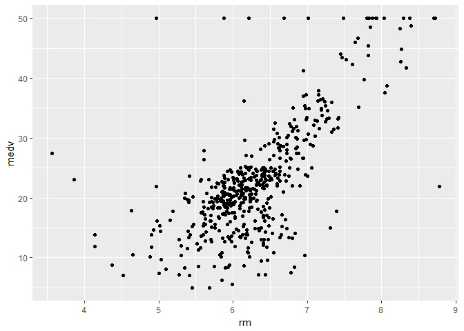
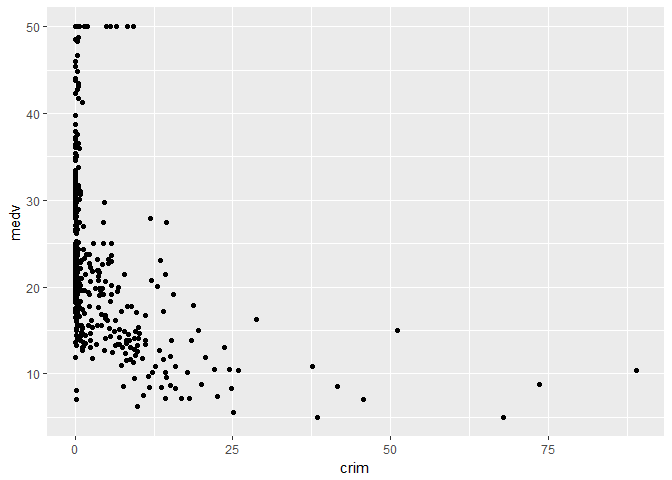
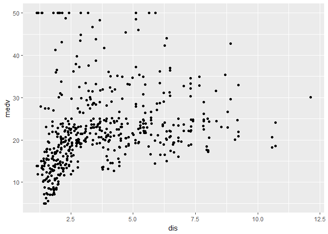

Lab 1 -- MATH 243
================
Theodore Dounias
September 6, 2017

**1**

``` r
dim(Boston)
```

    ## [1] 506  14

We have 506 different towns near Boston, for which we have collected data over 13 variables.

**2**

``` r
ggplot(Boston, aes(x = rm, y = medv)) +
  geom_point()
```



``` r
ggplot(Boston, aes(x = crim, y = medv)) +
  geom_point()
```



``` r
ggplot(Boston, aes(x = dis, y = medv)) +
  geom_point()
```



First plot is Median Value by Room Number, and is exactly what we would expect--more rooms add to the value of the house.

Second plot similarly shows how median value drops according to higher crime rate, but since most areas have a relativelly similarly low crime rate we cannot exactly say that it s a great predictor for median value.

Third plot is meadian value by distance to Boston. While initially there is an upward trend, this effect wares off at larger distances.

**3**

Several are, although I would hesitate to call them "predictors" for higher crime rate rather than variables that happen to be correlated. Predictors imply a relationship from one to the other, which is probably not true in terms of, for example, housing values. Anyway, some relationships--after running several scatterplots which are omitted here--:

River areas(chas) tend to have a consistently lower crime rate. There are fewer zoned lands over 25k sq.ft (zn) in high crime areas. Most areas with comparably higher crime rates are distributed between .6 and .8 in the nox variable. High crime areas tend to have older buildings(age). Higher distance from employment centers(dis), and lower lstat(whatever that is) are related lo lower crime rates in a slightly weak linear fashion. Medv was discussed in the previous question. The rest are omitted either because they do not seem to have such strond a trend, or because they are linked to the ones presented here.

**4**

We can run the summary() function to comment on the results.

``` r
summary(Boston)
```

    ##       crim                zn             indus            chas        
    ##  Min.   : 0.00632   Min.   :  0.00   Min.   : 0.46   Min.   :0.00000  
    ##  1st Qu.: 0.08204   1st Qu.:  0.00   1st Qu.: 5.19   1st Qu.:0.00000  
    ##  Median : 0.25651   Median :  0.00   Median : 9.69   Median :0.00000  
    ##  Mean   : 3.61352   Mean   : 11.36   Mean   :11.14   Mean   :0.06917  
    ##  3rd Qu.: 3.67708   3rd Qu.: 12.50   3rd Qu.:18.10   3rd Qu.:0.00000  
    ##  Max.   :88.97620   Max.   :100.00   Max.   :27.74   Max.   :1.00000  
    ##       nox               rm             age              dis        
    ##  Min.   :0.3850   Min.   :3.561   Min.   :  2.90   Min.   : 1.130  
    ##  1st Qu.:0.4490   1st Qu.:5.886   1st Qu.: 45.02   1st Qu.: 2.100  
    ##  Median :0.5380   Median :6.208   Median : 77.50   Median : 3.207  
    ##  Mean   :0.5547   Mean   :6.285   Mean   : 68.57   Mean   : 3.795  
    ##  3rd Qu.:0.6240   3rd Qu.:6.623   3rd Qu.: 94.08   3rd Qu.: 5.188  
    ##  Max.   :0.8710   Max.   :8.780   Max.   :100.00   Max.   :12.127  
    ##       rad              tax           ptratio          black       
    ##  Min.   : 1.000   Min.   :187.0   Min.   :12.60   Min.   :  0.32  
    ##  1st Qu.: 4.000   1st Qu.:279.0   1st Qu.:17.40   1st Qu.:375.38  
    ##  Median : 5.000   Median :330.0   Median :19.05   Median :391.44  
    ##  Mean   : 9.549   Mean   :408.2   Mean   :18.46   Mean   :356.67  
    ##  3rd Qu.:24.000   3rd Qu.:666.0   3rd Qu.:20.20   3rd Qu.:396.23  
    ##  Max.   :24.000   Max.   :711.0   Max.   :22.00   Max.   :396.90  
    ##      lstat            medv      
    ##  Min.   : 1.73   Min.   : 5.00  
    ##  1st Qu.: 6.95   1st Qu.:17.02  
    ##  Median :11.36   Median :21.20  
    ##  Mean   :12.65   Mean   :22.53  
    ##  3rd Qu.:16.95   3rd Qu.:25.00  
    ##  Max.   :37.97   Max.   :50.00

Dummy variables obviously are not represented perfectly, since they only take two distinct values. For the rest, Crime Rate, Zoning, distance to employment centers, accessibility to highways, lstat, and median value all seem to have significant jumps in their highest quintile. All except distance to employment centers also have a particularly low bottom quintile compared to the other quintiles.

**5**

We can use dplyr for this:

``` r
Boston5 <- Boston %>%
  filter(chas == 1)

nrow(Boston5)
```

    ## [1] 35

The resulting number is the number of cities on the river.

**6**

We get this from the summary, and it is equal to 19.05.

**7**

My output would be the medv variable. My input would be all other 13 variables in ths dataset. Obviously, in the process of actually constructing the model I would probably find that some of the variables are actually not that useful for a variety of reasons, and would subsequently drop them.
