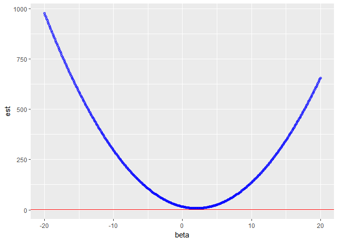
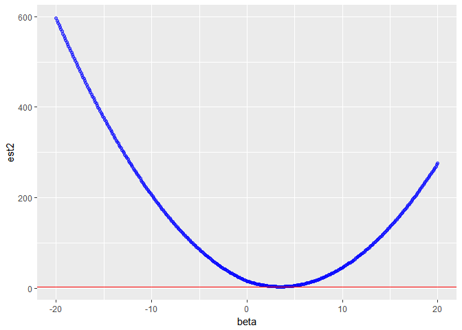

Problem Set 4 -- MATH 243
================
Theodore Dounias
September 25, 2017

#### Exercises 6.2(a, b), 6.3, 6.4, 6.6

**6.2(a, b)**

1.  c
2.  c

Both ridge regression and lasso are less flexible models than least squares regression. This means that they work best in situations where least squares has issues with variance, since the rigidity of the models compensates for that while making minimal tradeoffs in bias.

**6.3**

1.  1.  Based on figure 6.7, as we increase s, we increase the area of the constraint function, and include a contour of RSS that is closer to $\\hat\\beta$, therefore RSS steadily decreases.

2.  1.  If we initially increase flexibility, by increasing x, the test RSS will decrease until an optimal point, after which it will start increasing due to the model being too flexible.

3.  1.  Similarly to a, b, the model variance increases due to the increase in flexibility caused by a larger budget.

4.  1.  Bias decreases as the model becomes more flexible.

5.  1.  This is always constant

**6.4**

1.  1.  Increasing lamda restricts the coefficients more, therefore RSS will steadily increase.

2.  1.  Test RSS will decrease until its minimum point, and then start increasing steadily as the model gets more restricted.

3.  1.  Variance decreases as the model becomes less flexible.

4.  1.  Bias increases as the model becomes less flexible.

5.  1.  As previously, irreducible error is irreducible.

**6.6**

Here we will arbitrarily choose λ = 1, and y1 = 4. Thus we have:

``` r
lamda <- 1
beta <- seq(-20, 20, 0.1)
y1 <- rep(4, length(beta))
est <- (y1 - beta)^2 + lamda*(beta^2)
data <- data.frame(beta, est)

ggplot(data, aes(x = beta, y = est)) +
  geom_point(alpha = .5, color = "blue") +
  geom_hline(aes(yintercept = 4/(lamda + 1)), color = "red")
```



And for the second part of the question:

``` r
y1 <- rep(4, length(beta))
est2 <- (y1 - beta)^2 + lamda*(abs(beta))
data2 <- data.frame(beta, est2)

ggplot(data2, aes(x = beta, y = est2)) +
  geom_point(alpha = .5, color = "blue") +
  geom_hline(aes(yintercept = 4 - lamda/2), color = "red")
```



#### Crime Lasso/Ridge

``` r
attach(d)
```

    ## The following object is masked from package:tidyr:
    ## 
    ##     population

``` r
d <- d %>%
  select(-1, -2, -3, -4, -(101:126))
  
  
x <- model.matrix(ViolentCrimesPerPop~. , d)[,-1]
y <- d$ViolentCrimesPerPop

set.seed(14)
cv.ridge <- cv.glmnet(x, y, alpha = 0)
cv.lasso <- cv.glmnet(x, y, alpha = 1)

ridge.mod <- glmnet(x, y, alpha = 0, lambda = cv.ridge$lambda.min, standardize = TRUE)
lasso.mod <- glmnet(x, y, alpha = 1, lambda = cv.lasso$lambda.min, standardize = TRUE)

#Question 1
dim(coef(lasso.mod))
```

    ## [1] 97  1

``` r
#Question 2
ridge.pred <- predict(ridge.mod, s = cv.ridge$lambda.min, newx = x)
mean((ridge.pred - y)^2)
```

    ## [1] 0.01764507

``` r
lasso.pred <- predict(lasso.mod, s = cv.lasso$lambda.min, newx = x)
mean((lasso.pred - y)^2)
```

    ## [1] 0.01693373

The lasso MSE was slightly lower. This is surprising, because we would expect the ridge to outperform the lasso in variance, therefore having a lower training MSE. Maybe in this case it is because the true function f is a function of few of the predictors in the data, therefore making the lasso more accurate when setting them to zero.
