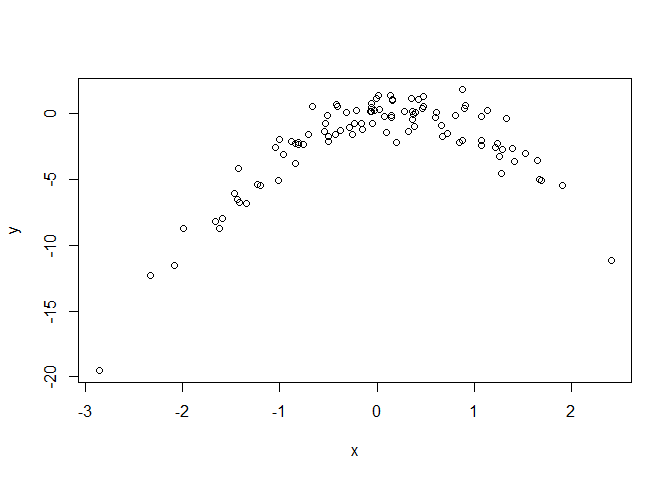

Problem Set 5--MATH 243
================
Theodore Dounias
October 13, 2017

#### ISLR, Chapter 5, Excercises 4, 8

**4**

We can use Bootstraping for this process. We sample with replacement from or original dataset, creating a series of datasets of the same length from which we then proceed to make our prediction again. We summarize those predictions in a graph and dataset of their own, from which we then proceed to calculate the standard deviation. This is the standard deviation of our prediction.

**8**

``` r
#1

set.seed(14)
y <- rnorm(100)
x <- rnorm(100)

y <- x - 2*x^2 + rnorm(100)

#n is 100, p is equal to 2

#2

plot(x, y)
```



``` r
#This sujests some form of quadratic relationship (which makes sense given how we generated the data)

#3
library(boot)
set.seed(13)
d <- data.frame(x, y)
cv.error <- rep(0, 4)
for(i in 1:4){
  glm.fit <- glm(y~poly(x, i), data = d)
  cv.error[i] <- cv.glm(d, glm.fit)$delta[1]
}
cv.error
```

    ## [1] 10.379286  1.126876  1.091420  1.205299

``` r
#4
set.seed(14)
d <- data.frame(x, y)
cv.error <- rep(0, 4)
for(i in 1:4){
  glm.fit <- glm(y~poly(x, i), data = d)
  cv.error[i] <- cv.glm(d, glm.fit)$delta[1]
}
cv.error
```

    ## [1] 10.379286  1.126876  1.091420  1.205299

``` r
#The results are identical. This happens because LOOCV is unaffected by this kind of sampling variability.


#5
#Interestingly enough, the cubic model outperforms the other two very slightly. This might be attributed to the random noise we #incorporated when generating our y's or most likely some coding error.

#6

summary(glm.fit)
```

    ## 
    ## Call:
    ## glm(formula = y ~ poly(x, i), data = d)
    ## 
    ## Deviance Residuals: 
    ##      Min        1Q    Median        3Q       Max  
    ## -2.33349  -0.66505  -0.06819   0.79780   2.49128  
    ## 
    ## Coefficients:
    ##             Estimate Std. Error t value Pr(>|t|)    
    ## (Intercept)  -2.2156     0.1034 -21.420   <2e-16 ***
    ## poly(x, i)1  15.0412     1.0344  14.542   <2e-16 ***
    ## poly(x, i)2 -28.9283     1.0344 -27.967   <2e-16 ***
    ## poly(x, i)3  -1.9031     1.0344  -1.840   0.0689 .  
    ## poly(x, i)4   0.4638     1.0344   0.448   0.6549    
    ## ---
    ## Signif. codes:  0 '***' 0.001 '**' 0.01 '*' 0.05 '.' 0.1 ' ' 1
    ## 
    ## (Dispersion parameter for gaussian family taken to be 1.069904)
    ## 
    ##     Null deviance: 1168.56  on 99  degrees of freedom
    ## Residual deviance:  101.64  on 95  degrees of freedom
    ## AIC: 297.42
    ## 
    ## Number of Fisher Scoring iterations: 2

``` r
#Here we see more of what we expected; the terms up to the quadratic are statisticaly significant at the .05 level, with the cubic coming close--which we would expect based on the previous results we had.
```
